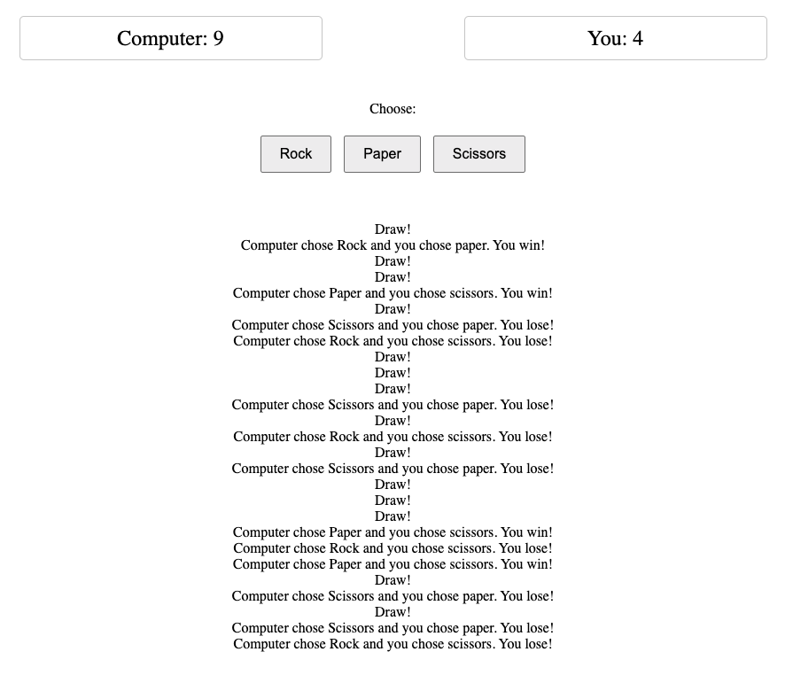
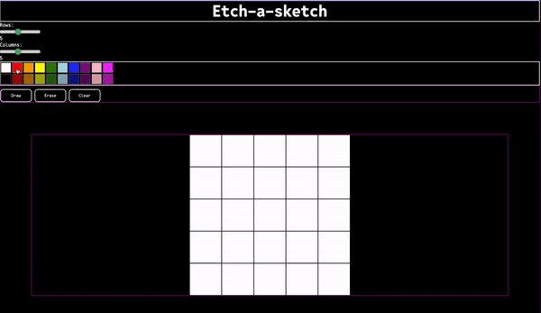
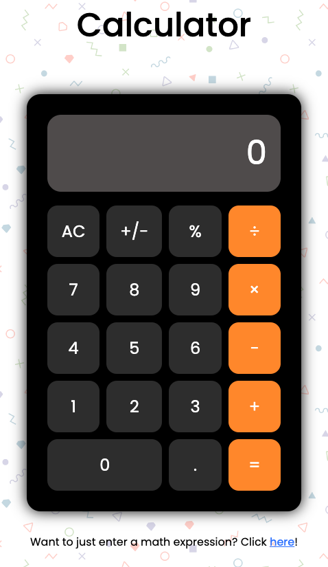
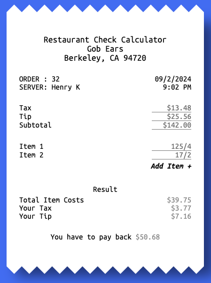
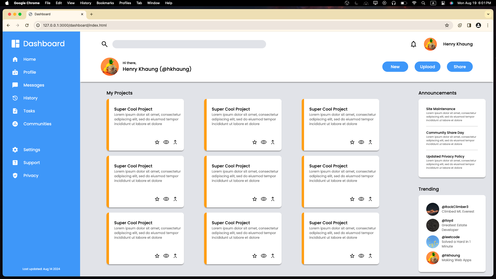
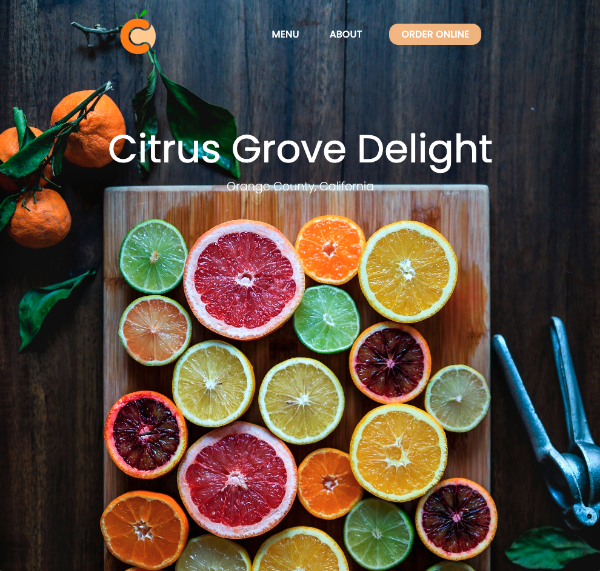

# the-odin-project

Exercises I did while following The Odin Project

## Foundation Course

1. Landing page

- the 4 boxes of images was not correct ie was not spaced correctly
- Below is the result with boxes outlined. The final result does not have these boxes/borders.
    

2. Rock Paper Scissors game

- to practice JS, nothing special (just an exercise)
- Below is the result
    

3. Etch-a-Sketch

- could be better styling and layout, only did the bare minimum
- Below is the result
    

4. Calculator

- Decided not to do calculator game -> figured not worth and I won't play it after I am done with it
- Instead made a receipt calculator and made the project public (check it out since my thoughts/summary is in that repo)
- Also made a functional calculator
- Below are results:

    

    
- You can check the live version [here](https://hkhaung.github.io).

## Node.js Course

1. Sign-up form (not connected to backend, done for practice)

2. Dashboard (no backend, done for practice but design used for portfolio website)
- problem: responsiveness (items in grid go out of the grid when window size becomes smaller)
- problem: text in flexbox (can't put a lot otherwise will push buttons outside the textbox)
- basically had to hardcode which is not good and website only looks good at 1980x1080
- Below is the result
    

3. Library
- no frontend, just JS, this project is to practice OOP
- might come back to add more to this

4. Tic Tac Toe
- no frontend, just JS, this project is also to practice OOP
- used prototypes instead of classes
- might come back to add more to this

5. Restaurant Page
- to practice using Webpack, a module bundler
- uses tabbed browsing ie each tab shows corresponding content
    - done by using webpack and imports/exports of functions
- the menu, about, and order online content are not implemented
- still don't know how to make websites responsive so website only looks right at certain sizes. See below:
    